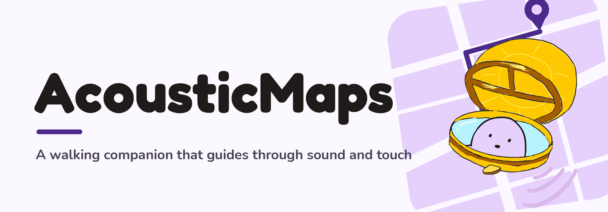
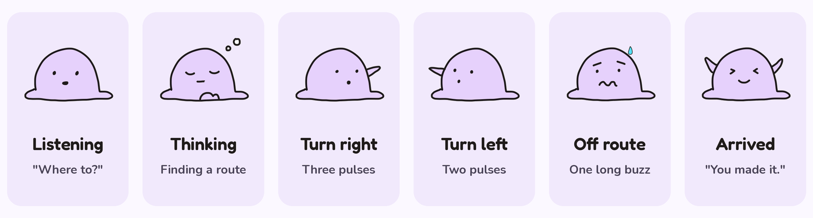
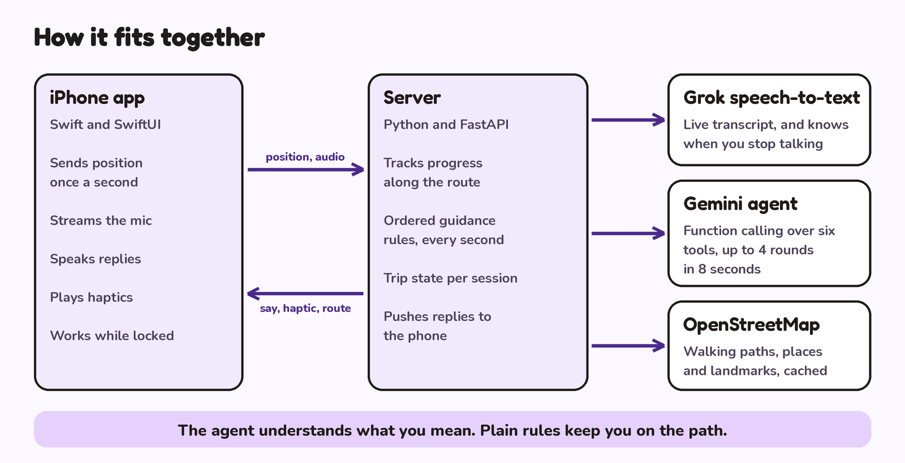

  
  

     
    <a>Joy Wang</a>
    ·
    <a>Sophia Lu</a>
     
    Built at BigRed//Hacks 2026
  

  
Table of Contents

  <ol>
    <li><a href="#inspiration">Inspiration</a></li>
    <li><a href="#what-it-does">What it does</a></li>
    <li><a href="#built-with">Built with</a></li>
    <li>
      <a href="#how-we-built-it">How we built it</a>
      <ul>
        <li><a href="#iphone-app">iPhone app</a></li>
        <li><a href="#server">Server</a></li>
        <li><a href="#grok-speech-to-text">Grok speech-to-text</a></li>
        <li><a href="#gemini-agent">Gemini agent</a></li>
        <li><a href="#openstreetmap">OpenStreetMap</a></li>
        <li><a href="#testing">Testing</a></li>
      </ul>
    </li>
    <li><a href="#challenges-we-ran-into">Challenges we ran into</a></li>
    <li><a href="#accomplishments-that-were-proud-of">Accomplishments that we're proud of</a></li>
    <li><a href="#what-we-learned">What we learned</a></li>
    <li><a href="#whats-next-for-acousticmaps">What's next for AcousticMaps</a></li>
    <li><a href="#run-it">Run it</a></li>
  </ol>

## Inspiration

Sophia is a poor navigator, and looking at a map while walking doesn't fix that.
For blind and low-vision walkers a map on a screen isn't an option at all.

We wanted walking directions that arrive by voice and touch: the app says when
to turn, notices when you drift off the route, and answers questions, with the
phone in a pocket.

(<a href="#readme-top">back to top</a>)

## What it does

- **Voice input.** Tap anywhere and talk. "Take me to Malott" and "somewhere I
  can get coffee" both work.
- **Spoken directions.** Short instructions using left, right, ahead and behind.
- **Haptics.** Two pulses for a left turn, three for a right, one long buzz when
  you're off route.
- **Corrections.** If you walk the wrong way, it says which way the path is and
  how far.
- **Questions.** "What's around me?" names nearby buildings and where they are.
- **Blob.** Our mascot sits in a compass and shows the trip's state on screen.

  

<!-- SCREENSHOTS: save them in design/readme/ and uncomment this block

  
  
  
  

-->

(<a href="#readme-top">back to top</a>)

## Built with

[![Swift][Swift]][Swift-url]
[![SwiftUI][SwiftUI]][SwiftUI-url]
[![Core Location][CoreLocation]][CoreLocation-url]
[![Core Haptics][CoreHaptics]][CoreHaptics-url]
[![Python][Python]][Python-url]
[![FastAPI][FastAPI]][FastAPI-url]
[![WebSockets][WebSockets]][WebSockets-url]
[![Grok][Grok]][Grok-url]
[![Gemini API][Gemini]][Gemini-url]
[![OpenStreetMap][OSM]][OSM-url]
[![Cloudflare Tunnel][Cloudflare]][Cloudflare-url]

(<a href="#readme-top">back to top</a>)

## How we built it

  

### iPhone app

Swift and SwiftUI, deliberately thin. It sends position once a second, streams
microphone audio, speaks replies, and plays haptics. It keeps working with the
phone locked in a pocket.

### Server

Python and FastAPI, where all the logic lives. Every second it runs an ordered
list of checks (weak GPS, arrived, off route, turn now, wrong way, turn ahead)
and the first one that fires is what you hear.

### Grok speech-to-text

Audio streams from the phone to our server and on to Grok, which transcribes
live and decides when you've stopped talking, so there is no stop button.

### Gemini agent

Handles anything open-ended. It runs function calling in a loop of up to 4
rounds within 8 seconds, over six tools backed by real data:

| Tool | What it does |
|---|---|
| `search_places` | Cafés, libraries and so on near you, from OpenStreetMap |
| `plan_route` | Distance, turns and minutes to a place, without starting |
| `start_navigation` | Starts the trip and sends the route to the phone |
| `cancel_navigation` | Ends the trip |
| `trip_status` | Distance left, the next instruction, and which way back to the route if you're off it |
| `describe_surroundings` | Named buildings within 60 m, with left, right or behind directions |

Gemini also rewords our instructions so they sound natural.

### OpenStreetMap

Walking paths, places and landmarks, cached so a trip doesn't wait on a slow API.

### Testing

A fake phone walks any route with GPS noise, detours and reversals, and we
replay recordings of our real walks through the server.

(<a href="#readme-top">back to top</a>)

## Challenges we ran into

**Navigation**

- **Curved paths.** Straight-line distance is wrong on a bend. We measure
  distance along the route instead. On a quarter-circle test route of 20
  segments, that gives 78.5 m where the straight line gives 70.7 m.
- **Knowing a turn was passed.** Our first rule was "the distance to the turn
  stopped shrinking." It broke when someone cut a corner, when a route passed
  the same spot twice, and when GPS jumped. We now track progress as distance
  along the route, which only moves forward.
- **Repeated GPS readings.** The phone sends an update every second, but GPS
  doesn't always have a new reading, so the phone re-sends the last one. The
  server compares each reading's timestamp and skips repeats, so one bad fix
  can't count several times.
- **GPS that is plainly wrong.** Readings with poor accuracy are ignored for
  tracking, and a correction needs three bad updates in a row before the app
  speaks.
- **Junctions with similar paths.** Where two paths leave a junction at close
  angles, "turn left" doesn't say which one. The instruction names a landmark
  and uses words like "slight left," and the same wording guides someone back
  onto the right path if they take the wrong one.

**iPhone**

- Connecting a physical iPhone to Xcode.
- Getting app signing, developer trust and permissions working.
- Reading live location, heading and walking speed.

**Voice**

- Streaming audio from the microphone to our server and on to Grok.

(<a href="#readme-top">back to top</a>)

## Accomplishments that we're proud of

- The full trip works: speak a place, pocket the phone, and walk there.
- Gemini handles open requests and fixed rules handle guidance, so directions
  never wait on a model.
- We collected our own data. The server logs every update from the phone, so
  each real walk is saved as a recording.
- A simulator that replays those recordings, so we can test a walk without
  leaving the building.
- We corrected the guidance from real walks, not guesses: when a recording
  showed a wrong instruction, we replayed it until the fix held.
- Blob, drawn by hand.

(<a href="#readme-top">back to top</a>)

## What we learned

- Real GPS behaves differently from a simulator, and we only found the problems
  by walking the routes.
- Which parts suit a language model and which are better as a few `if` statements.
- Writing for someone who can't see the screen: no visual references in speech,
  and every state needs a sound or a haptic.

(<a href="#readme-top">back to top</a>)

## What's next for AcousticMaps

- Starting a trip with Siri, without opening the app
- Alternative entrances, so a route ends at the door you want
- Accessible routes that account for stairs and elevation change
- Indoor guidance
- Testing with blind and low-vision walkers
- Apple Watch haptics
- Running on the phone with no server
- Learning where GPS is unreliable from past walks

(<a href="#readme-top">back to top</a>)

## Run it

[SERVER: setup and run commands]

[IOS: open the Xcode project, set the server address, run on a phone]

(<a href="#readme-top">back to top</a>)

<!-- MARKDOWN LINKS & IMAGES -->
[Swift]: https://img.shields.io/badge/Swift-F05138?style=for-the-badge&logo=swift&logoColor=white
[Swift-url]: https://www.swift.org/
[SwiftUI]: https://img.shields.io/badge/SwiftUI-0D96F6?style=for-the-badge&logo=swift&logoColor=white
[SwiftUI-url]: https://developer.apple.com/swiftui/
[CoreLocation]: https://img.shields.io/badge/Core_Location-1F1B1A?style=for-the-badge&logo=apple&logoColor=white
[CoreLocation-url]: https://developer.apple.com/documentation/corelocation
[CoreHaptics]: https://img.shields.io/badge/Core_Haptics-1F1B1A?style=for-the-badge&logo=apple&logoColor=white
[CoreHaptics-url]: https://developer.apple.com/documentation/corehaptics
[Python]: https://img.shields.io/badge/Python-3776AB?style=for-the-badge&logo=python&logoColor=white
[Python-url]: https://www.python.org/
[FastAPI]: https://img.shields.io/badge/FastAPI-009688?style=for-the-badge&logo=fastapi&logoColor=white
[FastAPI-url]: https://fastapi.tiangolo.com/
[WebSockets]: https://img.shields.io/badge/WebSockets-4B2A8C?style=for-the-badge
[WebSockets-url]: https://developer.mozilla.org/en-US/docs/Web/API/WebSockets_API
[Grok]: https://img.shields.io/badge/Grok_speech--to--text-000000?style=for-the-badge&logo=x&logoColor=white
[Grok-url]: https://x.ai/api/voice
[Gemini]: https://img.shields.io/badge/Gemini_API-8E75B2?style=for-the-badge&logo=googlegemini&logoColor=white
[Gemini-url]: https://ai.google.dev/
[OSM]: https://img.shields.io/badge/OpenStreetMap-7EBC6F?style=for-the-badge&logo=openstreetmap&logoColor=white
[OSM-url]: https://www.openstreetmap.org/
[Cloudflare]: https://img.shields.io/badge/Cloudflare_Tunnel-F38020?style=for-the-badge&logo=cloudflare&logoColor=white
[Cloudflare-url]: https://developers.cloudflare.com/cloudflare-one/connections/connect-networks/
